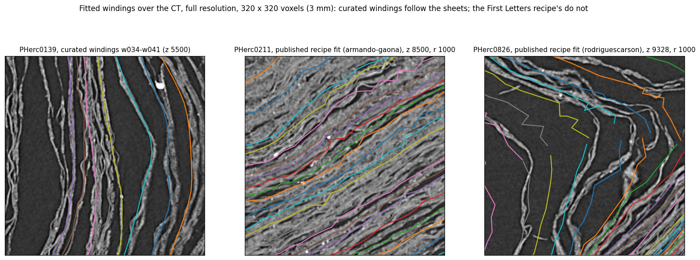
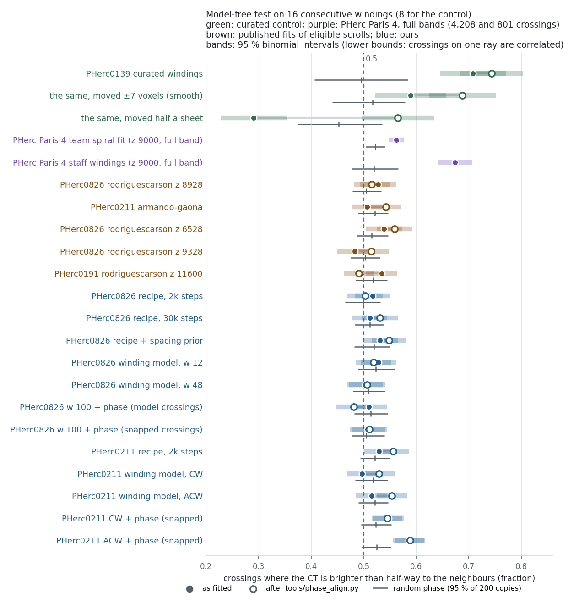

# Do the First Letters spiral fits follow the sheets? A model-free check, and winding-model supervision for eligible scrolls on free GPUs

**Submitted 26 Sep 2026** (Vesuvius Challenge progress prize).

A contribution to the open problem on spiral fitting and winding annotations of the challenge's 2026 open problems
page ("devise better evaluation suites and loss functions to fit the spiral"): an evaluation of spiral fits that needs
no annotations and runs on any fit, with its chance level measured on the scan and calibrated on PHerc Paris 4's staff
windings and spiral fit; the first crossing stores of villa's neural winding model (`winding_model_9um`) for two
eligible scrolls, made on free GPUs (Ian Onuska's winding meter writes stores of its own from the CT, without a
model); and a phase term for `fit_spiral` with the stores' crossings anchored to the CT's crests.

## At a glance

| question | answer (where) |
|---|---|
| Do the published spiral fits of eligible scrolls put their windings on the papyrus sheets? | Not detectably. On a model-free test of the raw CT, all five we found score between −0.017 and +0.009 relative to their own windings shifted to random positions along the same rays (full bands, 1,500–11,200 crossings, p = 0.21–0.92). The team's own spiral fit of PHerc Paris 4, which carries that scroll's ink detections, scores 0.024–0.070 above its copies in every band (p ≤ 0.005); staff windings 0.07–0.15 above, curated PHerc0139 windings 0.13–0.21 (§1, §4). |
| Does `fit_spiral`'s winding-model loss fix that? | On PHerc0826 it fixes the median winding density (5 windings per 5 sheets instead of 6), not where the windings sit: 0.50–0.53 on blocks, and at chance over the whole band. On PHerc0211 the refits sit a little closer to the sheets than chance over the whole band (0.550 and 0.558 against 0.525 for their random-shift copies, p ≤ 0.005; the published fit of the band 0.517 against 0.518), though not in the middle block (§3, §5). |
| Why not? | The loss is relative, and the crossing store is registered at the seed fit's windings; the model's phase follows the CT only loosely beyond that anchor (§3, §4). |
| Can windings be moved onto the sheets afterwards? | Only windings that run along a sheet: `tools/phase_align.py` brings shifted curated windings back (51 % → 82 % on their sheet) but barely changes the fits and doubles windings, because their windings cross sheets (§4). |
| What sets the recipe's winding spacing? | Its initial value: 120, 101 and 74 windings at 16, 24 and 32 voxels (§1). |
| Which way does PHerc0211 spiral? | Open, leaning anticlockwise: the anticlockwise refit has the lower loss, more satisfied tracks, the better held-out counts and, with snapped crossings, the higher block score (0.586 against 0.547), as bnleft's recipe fits had a slightly lower loss in another band; the clockwise refits render with more contrast (0.154 against 0.103; 0.078 against 0.067 with snapped crossings), and on the Lasagna slide around a turn the two pairs disagree (without the phase term the anticlockwise refit slides less, 0.26 against 0.50 sheets; with it the clockwise one, 0.52 against 0.82) (§5). |
| Do crossings snapped onto the CT's crests, with a phase term, put the windings on the sheets? | On PHerc0211 they put them on bright layers: the anticlockwise refit is the first fit of an eligible scroll we found above its random-shift copies on a block of 16 windings as fitted (0.586 against 0.524, 0 of 200 as high); over the whole band it scores 0.566 against 0.528, as the refits without the phase term already did (0.558 and 0.550 against 0.525). But it slides across more sheets around a turn and renders with less contrast than the refit without the phase term, so it may hop between sheets between the store's crossings; an ink run on every 5th winding finds no ink-like signal on it, nor on the refit without the term (§6). On PHerc0826 the second-generation refits stay at chance on the block and over the whole band, and match the model's counts worse (§3). |
| Can I check my own fit? | Yes: `tools/block_audit.py` on one machine, or the audit notebook on Kaggle's free CPUs (Reproduce). |

## Summary

- **The published fits sit no closer to the sheets than chance.** The published First Letters workflow fits a
  scroll's windings with `fit_spiral` with its spacing loss switched off. On full bands with 150 rays, the five
  published fits of eligible scrolls (PHerc0211, 0826 and 0191) score −0.017 to +0.009 relative to their own windings
  shifted to random positions along the same rays (1,500–11,200 crossings, p = 0.21–0.92; the two with the most
  crossings +0.001 and +0.002, on 11,178 and 6,776), where the PHerc Paris 4 team's own spiral fit, whose windings
  carry the published ink detections, scores 0.54–0.59, +0.024 to +0.070 above its copies (p ≤ 0.005 in every band),
  and staff windings of the same scan 0.59–0.67 (§1).
- **The test and its calibration.** The model-free test asks, along a ray through the raw CT, whether the scan is
  brighter where a winding crosses than half-way to the neighbouring windings. Curated windings of PHerc0139 score
  0.663 (0.645 on the 32 rays where the same windings, moved half a sheet off, score 0.335); windings unrelated to the
  sheets score about 0.5, and curated windings moved by a smoothly varying offset of up to half a sheet 0.53–0.59
  (§4). The chance level of each fit is measured on the scan itself, with 200 copies of the fit shifted to a random
  position along each ray (a random-shift null). armando-gaona's published PHerc0211 fit scores 0.511 (4,475 crossings
  on 60 radial rays), rodriguescarson's published fit of PHerc0826 z 8928–9728 0.504 (1,823 crossings on 31 rays),
  our recipe fit of the same band 0.507 (4,496 crossings). On a block of 16 windings, every published spiral fit of an
  eligible scroll that we could find scores 0.48–0.54, and so do our own fits but the PHerc0211 ones with the phase
  term on snapped crossings below, the winding-model refits included (0.50–0.53): within 0.04 of 0.5 (binomial
  standard error about 0.017 per block), against 0.71 for curated windings on a block of 8 windings. Each published
  fit is inside the 95 % range of its copies (one-sided p = 0.065–0.92), while none of the copies reaches the curated
  windings. A block is a small sample, though: 900 crossings of 8 windings of the Paris 4 team fit are at p = 0.055,
  so the full bands are what separates the fits.
- **Why, and what else sees it.** Full-resolution cross-sections show windings that bunch (three or four where the
  CT has one or two sheets) and elsewhere step over several sheets. A check of orientation passes on such fits (they
  are parallel to the sheets; ShribyrLabs' on-layer gate gives 0.75–0.89 on PHerc0826) and cannot see where a winding
  sits between two sheets (§1). This is consistent with what the published attempts saw (no ink detected on PHerc0211
  by armando-gaona and bnleft, nor on PHerc0826 by Miller & Müller and by ShribyrLabs on three more bands), though
  `ink_9um` is also weak outside its training scrolls, so it is not the only possible reason. Anyone can check a fit
  the same way: `tools/block_audit.py` on one machine, or the audit notebook on Kaggle's free CPUs ("Check your own
  fit", below).
- `fit_spiral` has a loss meant to constrain the winding density (`dense_spacing_mode: winding_model`), but it needs a
  crossing store from
  the Vesuvius winding model, published so far only for PHerc Paris 4. We made the first stores from that neural
  model for eligible scrolls (PHerc0826 and PHerc0211) on Kaggle's free T4s, with nothing to compile. (Ian Onuska's
  winding meter already writes stores of its own from the raw CT, which `fit_spiral` reads the same way: on PHerc Paris 4
  they did about as well as the trained model's store, and he ran one on PHerc0257.)
- **The winding-model supervision constrains the density of the windings; where they sit, only weakly.** (Below, a winding's
  *phase* is where it sits between two sheets: 0 on a sheet, ½ half-way to the next; the winding model's phase is its
  continuous winding coordinate along a ray.) The loss compares the number of windings between two crossings of a ray
  with the model's count, which is unchanged if every winding moves by half a sheet; and the store's crossings have no
  absolute position of their own: the model predicts a phase with one free offset per slab ("absorbed by the
  shift-invariant loss and the consumer's per-ray registration", `winding_model.py`), and villa's exporter registers
  each ray at its seed point. villa says so itself: seeds on the `_spliced` meshes "snapped onto satisfied patches
  (real sheets)", while the raw spiral "can sit a winding or more off the true sheet and then mislabels the anchor"
  (`infer_winding_volume.py --seed-source`). The eligible scrolls have no verified patches to snap to. The recipe's
  only term that pins the exported windings to integer positions, the track DT loss (from step 25,000), ends with
  11–14 % of the tracks satisfied on PHerc0826 for the recipe fits and first refits (ours and Miller & Müller's) and
  24–26 % on PHerc0211. On PHerc0826 our refits match the model's median count on
  held-out rays (5-sheet spans: median 5 windings, against 6 for the recipe and for the 2,000-step seed fit on whose
  windings the stores are seeded) and, at weight 48, its pairwise counts somewhat better (exactly one winding between consecutive crossings:
  0.587, against 0.495 for the 30,000-step recipe fit and 0.574 for the seed); on PHerc0211 they do not beat the seed
  (0.628 and 0.638 against 0.656), on whose windings the held-out store is seeded. For every fit, the model's
  crossings fall between its windings where a random phase would put them (§3). On PHerc0211 the refits nevertheless
  sit a little closer to the sheets than chance over the whole band (0.550 and 0.558 against 0.525, p ≤ 0.005), not in
  the middle block (§5).
- **`tools/phase_align.py` moves a winding that runs along the sheets onto the sheet**, from the CT alone: profiles
  along the mesh normal, averaged over tiles; each tile moves to the nearest crest of its profile, consistent with its
  neighbours (real sheets are not evenly spaced, so the tool reads actual crests rather than the phase at one period).
  Ground truth on curated PHerc0139 windings moved along their normals by a smooth field of up to ±7 voxels: the share
  of vertices within 3 voxels of their own sheet goes from 51 % to 82 %, the model-free test from 0.530 to 0.738
  (curated: 0.699). Half a sheet off, a winding goes to the nearer sheet, often the neighbouring one, and 40 % of it
  stays between sheets: the tool is for windings that are roughly on their sheet. On the published fits of PHerc0211
  and PHerc0826 z 8928–9728, whose windings bunch and cross sheets, it changes the test little (0.506 → 0.542,
  0.527 → 0.515) and puts more neighbours on one sheet (gaps under 3 voxels 7.6 → 8.4 % and 9.8 → 17.5 %): moving a
  surface along its normal cannot separate two windings on one sheet. The same holds for all our fits but the two
  PHerc0211 refits with the phase term on snapped crossings: 0.50–0.53 as fitted, 0.48–0.56 aligned.
- **On PHerc0211, crossings snapped onto the CT's crests plus a phase term put the windings on bright layers.**
  `wm/snap_store.py --drop-unsnapped` moves each crossing of the store onto the nearest crest of the CT and keeps only
  runs of crossings that agree with the CT's crest count (76 % of the 1.9 million crossings snapped, 62.5 % kept), and
  `wm/phase_patch.py` adds a term to `fit_spiral` that pulls a winding onto every crossing. The anticlockwise refit
  with both is the first fit of an eligible scroll we found above its random-shift copies on a block of 16 windings
  as fitted: 0.586 against 0.524 (0 of 200 copies as high; 1,110 crossings), with few doubled windings (1.0 % of gaps
  under 3 voxels); over the whole band it scores 0.566 against 0.528 (6,193 crossings), in the range of the PHerc
  Paris 4 team fit, as the refits without the phase term already did (0.558 and 0.550 against 0.525). The clockwise
  refit is only marginal on the block (0.547, 11 of 200, inside its copies' 95 % range). Two measures disagree: around
  a turn these windings slide across more sheets of the Lasagna prediction than the refit without the phase term (0.82
  against 0.26 sheets per turn, mean absolute slide over four windings), and their renders have less contrast (0.067 against 0.103), as if each winding
  were pulled onto a crest where the store has a crossing and crossed sheets in between. An ink run on every 5th
  winding of the three PHerc0211 refits finds no ink-like signal on any of them (§6).
  On PHerc0826 the second-generation refits, with the same term, stay at chance on the block and over the whole band
  (snapped crossings: 0.513 against 0.510, 65 of 200 copies as high) and match the model's held-out counts worse (0.46
  and 0.49 against 0.59); their training store had only half its rays (§3).
- **What the phase costs the ink** (one 1024² crop of the control segment, PHerc0139 w035, which is in `ink_9um`'s
  training set): AUC 0.97 with the surface on the sheet, 0.90–0.97 within 4 voxels of it, 0.64–0.92 at 6–10 voxels
  (lower on the outer side). Moved +4 or −6 voxels (AUC 0.921 and 0.895 on the mesh cut around the crop) and then
  aligned: 0.961 and 0.976, as good as the published surface (0.969); moved +6, nearer the next sheet than its own, it
  stays at 0.74.

## 1. The recipe's windings and the sheets

The workflow (villa `spiral-fitting`, First Letters post of 18 Aug 2026) runs `fit_spiral` with
`input_disable_patches`, tracks and Lasagna normals, `loss_weight_shell_outer: 0`, `dense_spacing_mode: grad_mag` and
**`loss_weight_dense_spacing: 0`** (the exact overrides of Miller & Müller's runbook and of ours). villa's own default is
`dense_spacing_mode: winding_model` at weight 12, which needs a winding-inference store.

With no term on the spacing, nothing ties a winding to a particular sheet: the Lasagna normal loss aligns each
winding's *orientation* with the sheets, and the tracks constrain it weakly (on PHerc0826, 10.8–14.4 % of tracks
satisfied after 30,000 steps, ours and Miller & Müller's; `data/kaggle_runs_summary.jsonl`). On average the windings
keep roughly their initial radial spacing (villa's default `model_initial_dr_per_winding` is 16 voxels; the published
PHerc0211 fit has 16.5 voxels per winding between windings 30 and 120, `data/armando_0211_radius_profile.json`), but
locally they drift across the sheets. A sweep shows how directly the spacing follows its starting value: 2,000-step
recipe fits of PHerc0826 z 8928–9728 that differ only in the initial spacing export 120, 101 and 74 windings at 16
voxels (villa's default; the same with the gap expander's weight decay off), 24 and 32, and the distance between
neighbouring windings grows with it (median 0.63, 1.06 and 1.51 sheet spacings by the pitch measure of the September
atlas, which compares fits of one band even though it is not a density, below; `data/dr_sweep_PHerc0826.jsonl`,
notebook pherc0826-recipe-winding-spacing-sweep). A fifth run, without tracks, exported nothing: its winding range
came out empty. ShribyrLabs found the same on PHerc0139: the spacing "does not learn" (16 → 17.0 and 27.8 → 27.8
voxels, report 01).

**Model-free test (`tools/sheet_hits.py`).** Along a ray through the CT (radial from the umbilicus, or the rays of a
crossing store), the intensity is sampled every 0.5 voxel and smoothed (σ = 1 voxel). At every crossing of a fitted
winding, c = (I(crossing) − mean(I at the two mid-points to the neighbouring crossings)) / (p95 − p5 of the ray).
When every winding lies on a sheet, every mid-point lies in a gap and c > 0 for nearly all crossings; with two
windings per sheet, or windings unrelated to the sheets, about half; with windings in the gaps, none. Synthetic check
(`tests/test_sheet_hits.py`): 1.00, 0.50 and 0.00, and 0.33 for windings at 2/3 of the sheet spacing. The test asks
whether the windings are *on* the sheets: windings that run parallel to the sheets at an offset that varies from place
to place score much less than windings on them (0.53–0.59 for curated windings moved by up to half a sheet, §4).
Whether a winding crosses sheets is measured by the render contrast and the cross-sections (§3).

Calibration on real data: sixteen consecutive **curated** windings of PHerc0139 (w030–w045, the published 9.362 µm
meshes), radial rays r 1000–1800 around the scroll axis: **0.663** (1,051 crossings on 130 rays; median c +0.18; 0.645
on the 32 rays below). The same windings moved along their normals by 4, 7 and 14 voxels (the scan's average sheet
spacing is 14 voxels; these windings are 16–17 voxels apart along the rays, and their neighbouring sheets 12 to 27
voxels away along the normals): 0.40, 0.335 and 0.46 (moved by the average spacing they do not come back to 0.65,
because the sheets are not evenly spaced). So on a real 9 µm scan the scale runs from about 0.33 (windings in the gaps)
through about 0.5 (windings unrelated to the sheets) to 0.645–0.71 (curated windings; compressed regions without gaps
pull every fit towards 0.5). Curated windings moved by an offset that varies smoothly within ±7 voxels (up to half a
sheet) score 0.53–0.59, above their random-shift null (§4).

**Orientation checks pass on fits of this kind.** The Lasagna normal loss makes the windings parallel to the sheets, so
a check of orientation is satisfied whether a winding sits on a sheet or between two: armando-gaona reports the fitted
tangent following the sheets at 0.99 on PHerc0211, and ShribyrLabs' on-layer gate (share of mesh points whose normal
agrees with the CT's structure-tensor normal, |cos| > 0.8) gives 0.84–0.88 and 0.87–0.89 on their spiral fits of two
low bands of PHerc0826 from the published tracks and 0.75–0.79 on a third (a staff mesh of PHerc Paris 4 0.955, a
known-bad mesh 0.70). Those fits were not published, so they are not tested here. ShribyrLabs also
found that a point-intensity "on-sheet" check fails on a validated fit (0.014 on the Paris 4 fit against 0.51 for its
points snapped to the nearest bright voxel), because a sheet at 9 µm is a bundle of strands with gaps; the test above
does not threshold intensities at the mesh but compares each crossing with the mid-points to its neighbours on the
same ray, and it separates curated windings (0.645–0.71) from the same windings moved half a sheet (0.29–0.35).

**Chance level and errors.** `--null K` measures the chance level on the scan itself (a random-shift null): K copies
of the fit in which every ray's crossings are shifted together by a random offset within ± half their median gap on
that ray (the fit's own spacing, at a random position relative to the sheets); the share of the copies that score at
least as high as the fit is a one-sided p-value, with a resolution of 1/K. The copies of the curated windings score
0.53 on average (95 % range 0.49–0.56) and none of 200 reaches the windings' 0.663; the copies of the two published
fits score 0.52 and 0.50, and 166 and 58 of 200 score as high as the fits. On evenly spaced synthetic sheets the null
is about 0.5, and about a third for windings at half the sheet spacing (`tests/test_sheet_hits.py`), so it depends on
the fit's spacing as well as on the scan. The binomial standard error is about 0.007 for the rows below with
4,000–4,500 crossings, 0.017 for a block of 16 windings and 0.035 for the 8-winding control blocks (§4); crossings on
one ray are correlated, so these are lower bounds.

| fit | scroll, band | rays | crossings | c > 0 (fraction) | random-shift null: mean (copies ≥ fit) |
|---|---|---|---|---|---|
| 16 curated windings (w030–w045), positive control | PHerc0139, z 3000–8000 | 130 radial, r 1000–1800 | 1,051 | 0.663 | 0.526 (0/200) |
| the same, 32 of those rays | PHerc0139 | 32 radial | 251 | 0.645 | 0.513 (0/200) |
| the same, moved half a sheet spacing (7 voxels) along the normals | PHerc0139 | same rays | 245 | 0.335 | 0.464 (200/200) |
| armando-gaona, published recipe fit (30,000 steps) | PHerc0211, z 8000–9000 | 60 radial, r 300–2000 | 4,475 | 0.511 | 0.517 (166/200) |
| rodriguescarson, published fit of the same band | PHerc0826, z 8928–9728 | 31 radial, r 300–2200 | 1,823 | 0.504 | 0.497 (58/200) |
| armando-gaona's fit, 150 rays | PHerc0211, z 8000–9000 | 150 radial, r 300–2000 | 11,178 | 0.521 | 0.520 (78/200) |
| rodriguescarson's fit, 150 rays | PHerc0826, z 8928–9728 | 150 radial (116 in the scan), r 300–2200 | 6,776 | 0.506 | 0.504 (80/200) |
| rodriguescarson's fit of another band, 150 rays | PHerc0826, z 6528–7328 | 150 radial (134 in the scan), r 300–2200 | 1,636 | 0.514 | 0.505 (42/200) |
| the same, a third band | PHerc0826, z 9328–10128 | 150 radial (124 in the scan), r 300–2200 | 1,518 | 0.484 | 0.501 (184/200) |
| rodriguescarson's fit of PHerc0191, 150 rays | PHerc0191, z 11600–12400 | 150 radial, r 300–2200 | 2,106 | 0.522 | 0.519 (77/200) |
| our recipe fit (30,000 steps) | PHerc0826, z 8928–9728 | 80 radial, r 300–2200 | 4,496 | 0.507 | 0.507 (99/200) |
| recipe + clamped grad_mag spacing prior, weight 100 (30,000 steps) | PHerc0826 | same rays | 4,781 | 0.516 | 0.511 (43/200) |
| recipe seed (2,000 steps) | PHerc0826 | same rays | 4,832 | 0.495 | 0.500 (154/200) |
| refit, winding model weight 12 (30,000 steps) | PHerc0826 | same rays | 4,369 | 0.517 | 0.508 (21/200) |
| refit, winding model weight 48 (30,000 steps) | PHerc0826 | same rays | 4,176 | 0.502 | 0.504 (124/200) |
| second-generation refit: weight 100 + phase term on the model's crossings (30,000 steps) | PHerc0826 | same rays | 5,122 | 0.503 | 0.505 (120/200) |
| the same, phase term on the snapped crossings | PHerc0826 | same rays | 5,264 | 0.513 | 0.510 (65/200) |
| the winding model's own crossings (held-out store, seeded on the 2,000-step recipe fit) | PHerc0826 | 600 of the store's rays | – | 0.510 | – |
| the same for PHerc0211 (store seeded on a 2,000-step recipe fit) | PHerc0211, z 8000–9000 | 600 of the store's rays | – | 0.502 | – |
| eight consecutive staff windings (5753_−7 … 5753_0), positive control | PHerc Paris 4 (2.4 µm scan at level 2, 9.6 µm), z 5000–6000 / 9000–10000 | 150 radial, r 100–800 | 856 / 801 | 0.591 / 0.674 | 0.525 (0/200) / 0.520 (0/200) |
| the team's spiral fit of PHerc Paris 4, windings w010–w027 (published with the scroll's ink detections) | PHerc Paris 4, the same bands | 150 radial, r 100–800 | 2,148 / 2,117 | 0.568 / 0.591 | 0.514 (0/200) / 0.521 (0/200) |
| the same fit, windings w028–w058 | PHerc Paris 4, z 5000–6000 / 9000–10000 / 13000–14000 | 150 radial, r 300–1800 | 4,259 / 4,208 / 4,367 | 0.538 / 0.563 / 0.537 | 0.515 (1/200) / 0.522 (0/200) / 0.509 (0/200) |

(Our fits and the model's crossings: the audit notebooks' RESULT lines, `data/audit_results_kaggle.jsonl`; the rest,
with the shipped `sheet_hits.py`: `data/sheet_hits_published_fits.jsonl`, `data/sheet_hits_calibration_curated0139.jsonl`
and, for PHerc Paris 4, `data/sheet_hits_paris4_team_fit_and_staff.jsonl` from `dev/paris4_check.py`.)

**A spiral fit that reads, on another scan.** PHerc Paris 4 has what the eligible scrolls lack: a spiral fit whose
windings were rendered for the published ink detections (the team's fit, `fitted_m7_ds2_z3000_18000` in the meshes'
metadata; we take its intermediate meshes, which sit in the scan's level-2 voxels, and checked on w038–w045 that the
final 2.4 µm meshes score the same), and staff windings of the same scan. The staff windings score 0.59–0.67 (the
curated PHerc0139 windings 0.66–0.71); the team's fit 0.54–0.59, above all or all but one of its 200 random-shift copies in
every band, but below the staff windings at the same radii. `tools/phase_align.py` (period 13 voxels) moves its
windings 1.3–1.5 voxels on median and raises it from 0.563 to 0.594 on z 9000–10000 (null 0.522 and 0.529), a change
of the size it makes on the blocks of the published eligible fits (−0.043 to +0.036, §4; it lowers two of the five); gaps
under 3 voxels between two different windings go from 0.02 % to 0.3 % (the rest of its 3.6 % after alignment are
folds of one winding), against 9.6 → 17.2 % on rodriguescarson's PHerc0826 block.

Two consequences for reading the rest of this report. First, a block has little power: 900 crossings of the Paris 4
fit (its windings w038–w045) are at p = 0.055, and the blocks of the published eligible fits have 800–1,130, so a
block that is inside its null could still be as good as the Paris 4 fit; only the full-band rows rule that out:
with 150 radial rays, the five published eligible fits are −0.017 to +0.009 from their nulls (1,518–11,178 crossings,
p = 0.21–0.92), the Paris 4 fit +0.024 to +0.070 (2,117–4,367 crossings, p ≤ 0.005); on the two eligible bands with
6,776 and 11,178 crossings, effects above about +0.01 are excluded. Second, the Paris 4 fit is not denser than the
sheets: its median gap (14–18 voxels) is at or above the spacing of the CT's crests (12–14 voxels), as for the staff
windings (15 against 11.5–12.5; the crests also count split sheets), while the published fits' inner windings are
closer together than the crests (below radius 500: 7.6 voxels against 12.0 on PHerc0211, 9.9–14.3 against
14.0–17.5 on PHerc0826, 11.5 against 14.0 on PHerc0191; 150-ray rows of `data/sheet_hits_published_fits.jsonl`).

*Fitted windings drawn over one CT slice at full resolution (320 × 320 voxels, 3 mm; `figures/make_xsec_figure.py`). Left:
curated PHerc0139 windings run along the bright sheets. Middle and right: the published fits of PHerc0211
(armando-gaona's recipe fit) and PHerc0826 (rodriguescarson) cut across sheets, run through the voids between sheet bundles and
pack into the bundles.* The audit notebooks draw the same kind of cross-section, at the same three places, for every
fit (`<fit>_xsection_l0_*.png`).

**How much of a surface is in empty space (`tools/surface_void.py`).** A vertex is in a void when the CT has no
papyrus within 6 voxels along its normal (papyrus = above the Otsu threshold of the scan's own intensities near the
fit). Curated PHerc0139 windings: 1.6 % of the surface; the same moved half a sheet: 13.8 %; rodriguescarson's
published PHerc0826 fit: 8.9 % (20–23 % on the inner windings, 5–10 % on the outer ones;
`data/surface_void_published.jsonl`). Most of a recipe winding is near papyrus but not on a sheet; a part runs
through the voids, which no alignment along the normal can repair.

Earlier numbers of ours that this replaces: the "pitch" of September (median nearest distance between consecutive
windings over a global sheet spacing, 0.36–0.67) mixes the bunching and the geometry of flattened sections and is not
a density: the published PHerc0211 fit has 0.5–0.67 by that measure (0.67 in September, 0.50 in the audit notebook,
which divides by another sheet spacing) but 16.5 voxels per winding radially (the scan's sheet spacing in
first-letters-scan-atlas is 15.1 voxels, 141 µm). We keep it only as a secondary number, to compare fits of one band.

## 2. Winding-model crossing stores for eligible scrolls, on free GPUs

What is published per scroll (checked 25 Sep 2026): every eligible scroll has Lasagna predictions (S3) and a tracks
dataset (`dl.ash2txt.org/datasets/spiral_datasets/<scroll>/<scan>/tracks`); umbilici are published for PHerc0125,
0211 and 0826 (S3) and, from the community, for ten more (github.com/AlexeyDrobkovStrikesBack/herculaneum-umbilici);
a winding-inference store exists only for PHerc Paris 4 (`spiral_datasets/PHercParis4/winding_inference`).

`wm/run_infer.py` runs villa's `infer_winding_volume.py --native-phase-only` with the public
[`scrollprize/winding_model_9um`](https://huggingface.co/scrollprize/winding_model_9um):

- `wm/vc.py`, a pure-Python/torch stand-in for volume-cartographer's `vc` bindings (local zarr, trilinear slab
  sampling on the GPU; nothing to compile);
- float16 autocast (T4s have no bfloat16; from the notebook's benchmark cell, `data/kaggle_runs_summary.jsonl`: fp16
  vs fp32 phase difference median 0.0016, same crossing counts on 24 benchmark slabs; 0.83 s per slab per T4);
- a compact phase cache that keeps only the columns the exporter decodes (the centre column, or a 3 × 3 grid of
  columns 40 voxels apart, `WM_COLUMN_GRID=3:40`, checked equal to the corresponding columns of the full field);
- a dead GPU worker no longer loses the run: its traceback is printed and saved, and the cache is closed with the
  slabs written so far (villa's exporter only reads the available entries).

villa's `export_spiral_supervision.py` then writes the store that `fit_spiral` loads unchanged.

| store | slabs | rays | crossings | median gap between crossings |
|---|---|---|---|---|
| PHerc0826 z 8928–9728, training (seeds on every 4th winding of a 2,000-step recipe fit) | 10,535 | 8,736 | 134,172 | 12.7 voxels (p10 9.1, p90 21.1) |
| PHerc0826, held out (other windings) | 1,230 | 1,010 | 15,488 | same |
| PHerc0211 z 8000–9000, training (3 × 3 columns per slab) | 14,008 | 104,422 | 1,894,767 | 11.9 voxels (p10 8.6, p90 18.6) |
| PHerc0211, held out | – | 12,145 | 220,065 | 11.9 voxels |

(From the notebooks' logs, `data/kaggle_runs_summary.jsonl`.)

## 3. Refits with the winding-model loss (PHerc0826, z 8928–9728, 30,000 steps)

| fit | c > 0 (radial rays) | c > 0 (store rays) | held-out rays: one winding per model sheet | render contrast | tracks satisfied |
|---|---|---|---|---|---|
| recipe | 0.507 | 0.510 | 0.495 | 0.066 | 11.0 % |
| winding model, weight 12 | 0.517 | 0.511 | 0.538 | 0.091 | 11.3 % |
| winding model, weight 48 | 0.502 | 0.509 | 0.587 | 0.096 | 10.8 % |

(All three 30,000 steps; `data/audit_results_kaggle.jsonl`, tracks from `data/kaggle_runs_summary.jsonl`. Against
the recipe fit of the same length the weight-48 refit puts exactly one winding between consecutive model crossings on
held-out rays in 0.587 of the pairs instead of 0.495, and matches the model's median count over 5-sheet spans, 5
windings instead of 6; neither is closer to the sheets in the model-free test, on radial rays or on the store's own
rays.)

"Held-out rays" (`tools/winding_agreement.py`): the rays of a second store, seeded on other windings and not used
for fitting, are intersected with the fitted windings; for consecutive model crossings the count of fitted windings
between them should be 1. This is agreement with the winding model, not ground truth (the model's own crossings are
scored by the model-free test above), and it is blind to phase (a fit shifted half a spacing scores the same), which
is why the model-free test is the headline.

**Density is not phase.** Both terms of villa's winding-model loss (`spiral-fitting/winding_supervision.py`: pairs of
crossings 3–15 apart, and adjacent crossings) compare the fit's winding difference between two crossings of one ray
with the model's level difference. Shifting every winding by half a spacing changes neither. In the rest of the recipe
the only term that pins the exported integer windings is the track DT loss (`loss_weight_track_dt` 10, from step
25,000 of 30,000: every point of a track is pulled to one integer winding); the track radius loss pulls a track to its
mean shifted radius ("continuous, not snapped to an integer winding"), and patches with known windings are off. The
anchor does not hold: tracks end 11.0 % (recipe), 11.3 % (weight 12) and 10.8 % (weight 48) satisfied, 14.4 % in
Miller & Müller's run. On the held-out rays:

| fit | exactly one winding between consecutive crossings | 0 / 2 windings | 5-sheet spans: median windings (exact) | model crossing to nearest winding, median, in model gaps (random phase) |
|---|---|---|---|---|
| recipe, 30,000 steps (notebook pherc0826-spiral-fit-30k-recipe-vs-clamped-prior) | 0.495 | 0.210 / 0.191 | 6 (0.171) | 0.236 (0.21) |
| recipe + clamped spacing prior, 30,000 steps (same notebook) | 0.535 | 0.137 / 0.226 | 6 (0.176) | 0.210 (0.21) |
| recipe seed, 2,000 steps (the held-out store is seeded on its windings) | 0.574 | 0.108 / 0.240 | 6 (0.166) | 0.190 (0.21) |
| winding model, weight 12 | 0.538 | 0.187 / 0.189 | 5 (0.211) | 0.245 (0.25) |
| winding model, weight 48 | 0.587 | 0.168 / 0.180 | 5 (0.271) | 0.239 (0.25) |
| second generation (below): weight 100 + phase term on the model's crossings | 0.485 | 0.157 / 0.225 | 6 (0.149) | 0.209 (0.21) |
| the same, phase term on the snapped crossings | 0.462 | 0.161 / 0.238 | 6 (0.142) | 0.210 (0.21) |

(13,378 pairs on the 961 of the 1,010 held-out rays that lie wholly inside the band, `data/audit_results_kaggle.jsonl`;
the 0 / 2 column is `heldout_count_dist` in the same file; median gap between the model's crossings 12.7
voxels. Last column: for each interior
model crossing, the distance along the ray to the nearest fitted winding over the model's local gap; if the windings
sat at a random phase with respect to the crossings, its median would be a quarter of the fit's spacing, about
0.25 × 5 / (windings per 5-sheet span), in brackets.) The held-out store is seeded on the seed fit's own windings (each
ray is registered at one of them), and the first refits are trained on a store seeded on them too, so this agreement
partly measures closeness to the seed. The weight-12
refit matches the model's median count, and its errors are symmetric (as many empty gaps as doubled ones), but its
pairwise agreement is not better than the seed's (on the training rays either, 0.554). At weight 48 the pairwise
agreement is somewhat better than the seed's (0.587 against 0.574; 5-sheet spans exact 0.271 against 0.166; 0.614 on
the training rays). The second-generation refits with the phase term (below) count worse than all of these (0.485 and
0.462, with a median of 6 windings per 5 sheets again). For every fit, the seed included, the model's crossings fall
between the windings about where a random phase would put them. On PHerc0211 the refits do not beat their seed (§5).
`wm/phase_patch.py` adds to the same
loss family

    phase = mean over sampled crossings c of (1 - cos(2 pi s(c) / dr)),   s = shifted radius of c in spiral space,

which is zero when every crossing lies on some exported winding and needs no winding labels. It reuses the crossings
and validity mask of the density pairs (no extra transform evaluations), is off unless `WM_PHASE_WEIGHT` is set, and
is checked on synthetic spirals (0 on the windings, 2 half-way, 1 at a quarter; gradient descent moves the windings
onto the crossings; `wm/tests/test_phase_patch.py`). Since the store's crossings are registered at the seeds (§4), the
second-generation refits use it two ways, on the same store: on the model's crossings, and on the crossings moved
onto the CT's crests by `wm/snap_store.py --drop-unsnapped` (crests as in `sheet_hits.py`; each crossing to the nearest
crest along its ray within half its local gap, one crossing per crest, and no move that would swap two crossings or
leave them closer than 4 voxels; then only runs of crossings whose crest number minus winding level is constant are
kept, each run as a ray of its own, so every pair spans as many crests as the model has windings; without
`--drop-unsnapped` the unsnapped crossings stay where the model put them; `wm/tests/test_snap_store.py`).

**Results of the phase term.** PHerc0211 (notebook pherc0211-snapped-store-refits-acw-vs-cw, `spec_0211_wm_snap.json`):
the training store of §5 snapped (76 % of its 1.89 million crossings moved onto a crest, median move 2.5 voxels; 62.5 %
kept, as 331,533 runs), then two refits identical but for the sense, winding-model weight 48 and phase weight 48 on
the snapped crossings, 30,000 steps. PHerc0826 (second generation, notebook pherc0826-winding-model-supervision-gen2-
phase, version 2): a new store seeded on the weight-48 refit's windings aligned with `tools/phase_align.py`, then two
refits at weight 100 with the phase term (48) on the model's crossings or on the snapped ones; one of the two GPU
workers failed half-way through the training seeds, so the training store has about half of them (48,420 of 90,432
rays inferred; 51 % of its crossings kept after snapping). The audit notebooks on Kaggle
(`data/block_our_fits_kaggle.jsonl`, `data/audit_results_kaggle.jsonl`):

| fit | block w062–w077: c > 0 (random-shift null; copies ≥ fit) | all windings, 80 radial rays: c > 0 (null; copies ≥ fit) | gaps under 3 voxels (block) | render contrast | Lasagna slide per turn, mean absolute value over four windings | tracks satisfied |
|---|---|---|---|---|---|---|
| PHerc0211, phase term on snapped crossings, anticlockwise | 0.586 (0.524; 0/200) | 0.566 (0.528; 0/200) | 1.0 % | 0.067 | 0.82 | 19.1 % |
| the same, clockwise | 0.547 (0.523; 11/200) | 0.557 (0.526; 0/200) | 1.0 % | 0.078 | 0.52 | 18.6 % |
| PHerc0211, weight 48 without the phase term, anticlockwise | 0.515 (0.521; 141/200) | 0.558 (0.525; 0/200) | 2.7 % | 0.103 | 0.26 | 25.5 % |
| the same, clockwise | 0.497 (0.517; 181/200) | 0.550 (0.525; 1/200) | 2.4 % | 0.154 | 0.50 | 24.2 % |
| PHerc0211, recipe seed (2,000 steps, clockwise) | 0.530 (0.522; 61/200) | 0.525 (0.517; 21/200) | 0.1 % | 0.086 | 0.60 | 21.8 % |
| PHerc0211, armando-gaona's published recipe fit | 0.506 (0.521; 179/200) | 0.517 (0.518; 126/200) | 7.6 % | 0.148 | 0.69 | – |
| PHerc0826, weight 100, phase term on snapped crossings | 0.508 (0.505; 83/200) | 0.513 (0.510; 65/200) | 2.3 % | 0.090 | 0.76 | 8.5 % |
| PHerc0826, weight 100, phase term on the model's crossings | 0.510 (0.513; 113/200) | 0.503 (0.505; 120/200) | 3.4 % | 0.091 | 0.70 | 9.0 % |
| PHerc0826, weight 48 without the phase term (first store) | 0.503 (0.510; 138/200) | 0.502 (0.504; 124/200) | 1.8 % | 0.096 | 0.96 | 10.8 % |

On PHerc0211 the phase term on snapped crossings is what lifts a block above chance: +0.061 for the anticlockwise
refit (0 of 200; for scale, the PHerc Paris 4 team fit's group of 8 windings is +0.030, §1) and a marginal +0.024 for
the clockwise one (11 of 200, inside its copies' 95 % range). Over the whole band both are above their copies (+0.038
and +0.032), but so were the refits without the term (+0.033 and +0.025); the published recipe fit is above chance
nowhere. It keeps doubled windings rare (1.0 %, aligned 2.3 % and 1.9 %). It also costs about a quarter of the
satisfied tracks, and the snapped anticlockwise windings slide across more sheets of the Lasagna prediction around a
turn and render with less contrast (median over 8–9 rendered patches of `tools/render_contrast.py`'s layer-profile
contrast, which is high for a surface that follows one sheet) than the refit without it. One reading fits all of these: the phase term pulls each winding onto a crest of the CT where the
store has a crossing (on its rays, up to 9 per slab), and between the crossings the surface may cross to the next sheet;
the model-free test samples crossings on radial rays and does not see that. The ink run on them (§6) finds no ink-like
signal, and there too their renders have less layer contrast than those of the refit without the term: either these windings
do not stay on one sheet long enough to show letters, or `ink_9um` does not read this part of the scroll (it is weak
outside its training scrolls); the lower render contrast points to the first. On PHerc0826 the same term leaves the
fits at chance on the block and over the whole band (80 radial rays, about 5,200 crossings: 0.513 and 0.503 against
0.510 and 0.505), costs pairwise agreement with the held-out model counts (0.462 and 0.485 against 0.587) and tracks,
and renders with about the same contrast (0.090 and 0.091 against 0.096) and slides a little less around a turn (0.76
and 0.70 against 0.96 sheets). What differs from PHerc0211 there: the
training store has half its rays (a GPU worker failed), and fewer of its crossings survived snapping (51 % against
62.5 %); these runs cannot tell whether that, the scroll or the band is what matters.

**What the phase costs the ink.** The control crop of PHerc0139 w035 rendered with its surface moved along the normal
(`ink/ink_phase_tolerance.py`; the crop's mean layer profile puts the sheet 2 voxels from the published surface):

| surface moved (voxels) | −8 | −6 | −4 | −2 (on the sheet) | 0 (published) | +2 | +4 | +6 | +8 |
|---|---|---|---|---|---|---|---|---|---|
| `ink_9um` AUC | 0.762 | 0.897 | 0.962 | 0.973 | 0.969 | 0.951 | 0.920 | 0.753 | 0.639 |

Within 4 voxels of the sheet (surface moved −6 to +2) the AUC stays at 0.90–0.97; at 6 voxels from it, about half
the local sheet spacing (crests 12 voxels apart in this crop), 0.76–0.92. Aligned with `tools/phase_align.py`
(period 17), the surfaces moved by +4 and −6 voxels (0.921 and 0.895 as moved, on the mesh cut around the crop) come
back to 0.961 and 0.976 (published surface 0.969, published surface aligned 0.976); the one moved by +6, closer to the
next sheet than to its own, stays at 0.737 against this sheet's labels (0.752 as moved); at period 14, 0.966, 0.976 and
0.740
(`data/ink_phase_tolerance_w035.jsonl`). One crop, one segment that is in `ink_9um`'s training set: this checks the
chain and the tool, not how the model generalizes. On this crop a surface within about a third of a sheet of its
sheet still shows the ink (AUC 0.90–0.97), and 6–10 voxels off it the AUC drops to 0.64–0.92 depending on the side; we
expect a winding that crosses sheets inside a letter to lose the ink, which this crop does not test.

## 4. Putting windings on the sheets: how the store's crossings are registered, and phase alignment

**The store's crossings are registered at the seed and carry no phase of their own.** The winding model predicts, per
slab, a monotone phase whose increments are the winding density; "the whole phase field shares one free offset,
absorbed by the shift-invariant loss and the consumer's per-ray registration" (`winding_model.py`). villa's exporter
(`decode_center_ray`) registers each ray at its anchor, the seed point, and keeps the integer passages of the
registered phase: the crossing at the anchor is where the seed is, and the others follow from the model's spacing.
villa seeds its production stores on verified sheets ("snapped onto satisfied patches (real sheets)"; the raw spiral
"can sit a winding or more off the true sheet and then mislabels the anchor", `infer_winding_volume.py
--seed-source`). Seeded on a fit's windings (as the eligible scrolls must be, having no verified sheets), the anchors
are wherever the fit's windings are. A direct check on the CPU (`wm/dev_model_brightness.py` on 15 radial slabs of
PHerc0826 at z 9328; `dev/model_register_check.py` re-registers the saved phase of each centre ray at three points,
`data/model_register_check_PHerc0826_z9328.json`): registered where the ray's CT is brightest within 8 voxels of its
centre, the other crossings score 0.541 in the model-free test; registered at the darkest point, 0.469; at the centre,
0.556 (about 100 crossings each, standard error 0.05); all crossings moved together along their rays by −8 to +8
voxels, 0.44–0.60. The swing is much smaller than for curated windings moved half a sheet (0.645 → 0.335 on the 32
calibration rays of §1), so at this height the model's phase follows the CT's bright layers only loosely beyond the
anchor, and where the anchor sits matters little for the other crossings (in the loose sector it counts about one
sheet where the CT has two or three bright layers, `data/wm_vs_gradmag_vs_ct_PHerc0826_z9328.jsonl`). Aligning the
seeds is meant to put more anchors on sheets (the second-generation store of PHerc0826 is seeded on aligned windings;
its refits stay at chance, §3), and `wm/snap_store.py` moves every crossing, not only the anchor, onto a crest of the CT
(§3; on PHerc0211 that puts the windings on bright layers).

**`tools/phase_align.py`.** For each winding mesh: the CT is sampled along the normal (−16 to +16 voxels, every 0.5) at
every second vertex; the profiles are averaged over tiles of 8 × 8 grid cells (160 × 160 voxels at the usual 20-voxel
grid), detrended and smoothed by 1.5 voxels. Each tile moves to the crest of its own mean profile nearest to where the
winding is and then, three times over, to its crest nearest to the median offset of the 3 × 3 tiles around it (itself
included), so that neighbouring tiles stay on one sheet (`--mode crest`, the default; a crest is a local maximum above
35 % of the profile's range within three quarters of a sheet period; a tile without one keeps offset 0). The tile
offsets are then smoothed (Gaussian, one tile), so a tile without a crest moves part of the way with its neighbours,
interpolated to every vertex, and each vertex moves along its normal. The grid, the validity mask and the
parametrisation are unchanged. The first version read each tile's offset from the phase of its component at the sheet
period instead (a crest at o gives arg F = −2π o / s, smoothed as amplitude-weighted unit vectors; `--mode phasor`),
which assumes evenly spaced sheets; they are not (below), and a synthetic test with a 26-voxel gap between sheets 14
apart shows the difference (`tests/test_phase_align.py`).

**Ground truth.** The curated windings w034–w041 of PHerc0139 (each on its own sheet), moved along their normals in
known ways, then aligned. For every vertex of the aligned interior windings: is it within 3 voxels of its own curated
winding, of another curated winding (a neighbouring sheet), or of neither (between sheets)? The model-free test runs on
60 radial rays that the aligner does not use (`dev/phase_align_groundtruth.py`; data in `data/phase_align_validation.jsonl`,
the crest column from the shipped tool):

| windings | as given: c > 0 | own / next / between | phase only (period 14): c > 0 | own / next / between | crest (period 17): c > 0 | own / next / between |
|---|---|---|---|---|---|---|
| curated, as published | 0.699 | 100 / 0 / 0 % | 0.727 | 90 / 2 / 9 % | 0.718 | 97 / 0 / 2 % |
| moved by a mild smooth field (median 1.6 voxels, at most 7) | 0.586 | 87 / 1 / 12 % | 0.717 | 90 / 2 / 8 % | 0.701 | 94 / 1 / 5 % |
| moved by a smooth field uniform in ±7 voxels | 0.530 | 51 / 8 / 41 % | 0.652 | 76 / 6 / 18 % | 0.738 | 82 / 4 / 14 % |
| moved 7 voxels (half a sheet) | 0.352 | 1 / 23 / 76 % | 0.494 | 11 / 37 / 52 % | 0.626 | 37 / 23 / 40 % |
| rough: mild field plus 3 voxels of per-vertex roughness | 0.583 | 67 / 5 / 27 % | 0.622 | 59 / 7 / 34 % | 0.654 | 67 / 5 / 28 % |

A winding that runs along its sheet at an offset of up to about a third of a sheet mostly comes back onto it (the
±7-voxel field: from 51 % to 82 % of the vertices within 3 voxels of their own sheet). Half a sheet off, it goes to the
nearer sheet, which on unevenly spaced sheets is the neighbouring one almost as often as its own, and 40 % of it stays
between sheets: the aligner is for windings that are roughly on their sheet. It does not remove per-vertex roughness
(the tiles are 160 voxels wide). The model-free test counts any sheet, so it also rises when a winding lands on the
neighbouring sheet (half a sheet off: 0.352 → 0.626), and alone it would not have shown that phase-only alignment puts
fewer rough vertices on their sheet (67 % → 59 %) while raising the test.

**The period.** The local sheet spacing varies a lot: along the normals of the curated windings the neighbouring
crests are 12 to 27 voxels away (18 along radial rays), the crests of the ink control crop of w035 are 12 voxels
apart, and the scan averages 14 (131 µm). The crest mode uses the period only to bound the move (three quarters of a
period) and hardly depends on it: at periods 14 and 17, 98 / 97 % of the curated windings' vertices on their sheet,
82 / 82 % after the ±7-voxel field, 34 / 37 % after the half-sheet shift. A variant that started each tile from the
phase offset was better half a sheet off when the period matched the local spacing (65 % back on the own sheet at 17,
83 % at 20, 20 % at 14) but moved windings to the wrong crest where the spacing was smaller than the period: on the ink
crop, the surface moved by +4 voxels scored AUC 0.921 as moved and 0.871 after that alignment at period 17, against
0.961 with the nearest-crest start. The notebooks pass 17 for PHerc0826 and PHerc0211, where the estimates of the
spacing disagree (12.7 voxels between the first store's crossings, 16.3 on average in the scan: 153 µm, the audit
spec's sheet spacing).

**Sheet jumps inside a winding.** Neighbouring parts of one winding can be moved onto different sheets. Of the vertices
of an aligned winding that lie on some curated sheet, the share on a sheet other than the one most of the winding is
on: 4 % for the curated windings aligned (the sheets touch in places), 9 % after the ±7-voxel field (phase only: 11 %),
34 % after the half-sheet shift (33 %), 12 % for the rough windings (15 %). An option to unwrap the phase across each
winding (`--unwrap`, quality-guided) removed the jumps on a synthetic winding but not on real ones: on the curated
windings it slipped by whole periods between noisy tiles and, after the half-sheet shift, moved 98 % of the vertices
onto a neighbouring sheet (model-free test 0.49). Snapping each vertex (rather
than each 160-voxel tile) to its own nearest crest raised the model-free test much more (0.697; the curated windings themselves went from 0.699 to 0.819)
without bringing the vertices back to their sheet: it finds bright voxels, not the sheet. Neither is part of the tool
(the experiments and their ground truth are kept with the development scripts); a brightness test alone cannot
validate a method that moves surfaces towards bright voxels.

**Two windings on one sheet.** Aligning windings one by one can put two of them on the same sheet where a fit has too
many windings, and the model-free test then scores both crossings as on a sheet. `sheet_hits.py` therefore also
reports the gaps between consecutive crossings along each ray (`gaps_vox`: the median, the fraction under 3 voxels,
the fraction over 1.5 × the median = a sheet skipped). A gap is taken between any two consecutive crossings of the
ray, so a gap under 3 voxels is two windings on one sheet or one winding that folds back or grazes the ray (the tool
now reports the two apart: on rodriguescarson's z 8928–9728 block, 9.6 of the 9.8 % are two windings, and 17.2 of the
17.5 % after alignment, `data/sheet_hits_gap_split_rc0826_8928.jsonl`); in the synthetic check
(`tests/test_sheet_hits.py`) a fit with one pair of windings on one sheet among seven windings has one of its six gaps
under 3 voxels, a fit on the sheets none. The audit notebooks report both, and the share of the surface in voids, for
a block of 16 consecutive windings of every fit, as fitted and aligned. The same block, run on the published fits and
on the curated control (the notebook's own code, on the CPU; `data/block_published_fits_and_control.jsonl`):

| block of windings | crossings | c > 0, as fitted → aligned | random-shift null, as fitted: mean (copies ≥ fit) | c > 0.1, as fitted | gaps under 3 voxels | surface in voids |
|---|---|---|---|---|---|---|
| PHerc0139, curated w034–w041 (control) | 202 | 0.708 → 0.744 | 0.495 (0/200) | 0.65 | 2.9 % → 2.5 % | 1.6 % → 1.6 % |
| the same, moved by the ±7-voxel field | 202 | 0.589 → 0.688 | 0.517 (3/200) | 0.51 | 5.0 % → 2.9 % | 4.1 % → 2.0 % |
| the same, moved half a sheet | 200 | 0.290 → 0.565 | 0.452 (200/200) | 0.22 | 3.0 % → 7.2 % | 13.8 % → 6.9 % |
| PHerc0211, armando-gaona's published recipe fit, w062–w077 | 1,124 | 0.506 → 0.542 | 0.521 (179/200) | 0.33 | 7.6 % → 8.4 % | 0.7 % → 0.7 % |
| PHerc0826 z 8928–9728, rodriguescarson's published fit, w037–w052 | 838 | 0.527 → 0.515 | 0.505 (13/200) | 0.30 | 9.8 % → 17.5 % | 8.9 % → 8.3 % |
| the same author's fit of PHerc0826 z 6528–7328, w037–w052 | 809 | 0.539 → 0.559 | 0.515 (14/200) | 0.39 | 4.7 % → 13.5 % | 5.8 % → 5.4 % |
| the same author's fit of PHerc0826 z 9328–10128, w037–w052 | 868 | 0.483 → 0.514 | 0.503 (184/200) | 0.34 | 4.1 % → 8.8 % | 7.8 % → 7.2 % |
| the same author's fit of PHerc0191 z 11600–12400, w037–w052 | 1,121 | 0.534 → 0.491 | 0.517 (22/200) | 0.37 | 2.3 % → 4.7 % | 5.2 % → 5.2 % |
| PHerc0826, our recipe fit (30,000 steps), w062–w077 | 837 | 0.511 → 0.531 | 0.512 (106/200) | 0.38 | 3.3 % → 10.0 % | 5.4 % → 5.0 % |
| PHerc0826, recipe + clamped grad_mag spacing prior, weight 100 | 847 | 0.531 → 0.548 | 0.520 (51/200) | 0.37 | 2.2 % → 7.5 % | 4.9 % → 4.6 % |
| PHerc0826, recipe seed (2,000 steps) | 839 | 0.517 → 0.503 | 0.500 (34/200) | 0.38 | 0.4 % → 4.5 % | 7.7 % → 7.3 % |
| PHerc0826, winding-model refit, weight 12 | 846 | 0.528 → 0.518 | 0.523 (79/200) | 0.40 | 2.3 % → 8.0 % | 5.2 % → 4.9 % |
| PHerc0826, winding-model refit, weight 48 | 847 | 0.503 → 0.507 | 0.510 (138/200) | 0.36 | 1.8 % → 5.0 % | 5.2 % → 5.0 % |
| PHerc0826, second-generation store: weight 100 + phase term on the model's crossings | 847 | 0.510 → 0.481 | 0.513 (113/200) | 0.32 | 3.4 % → 10.0 % | 5.9 % → 5.8 % |
| PHerc0826, the same, phase term on the snapped crossings | 847 | 0.508 → 0.511 | 0.505 (83/200) | 0.35 | 2.3 % → 9.7 % | 5.9 % → 5.5 % |
| PHerc0211, recipe seed (2,000 steps, clockwise), w062–w077 | 1,116 | 0.530 → 0.557 | 0.522 (61/200) | 0.39 | 0.1 % → 2.5 % | 0.7 % → 0.7 % |
| PHerc0211, winding-model refit, weight 48, clockwise | 1,124 | 0.497 → 0.529 | 0.517 (181/200) | 0.37 | 2.4 % → 4.4 % | 0.7 % → 0.6 % |
| PHerc0211, the same, anticlockwise | 1,124 | 0.515 → 0.554 | 0.521 (141/200) | 0.36 | 2.7 % → 7.1 % | 0.7 % → 0.6 % |
| PHerc0211, weight 48 + phase term on the snapped crossings, clockwise | 1,109 | 0.547 → 0.545 | 0.523 (11/200) | 0.42 | 1.0 % → 1.9 % | 0.7 % → 0.7 % |
| PHerc0211, the same, anticlockwise | 1,110 | 0.586 → 0.589 | 0.524 (0/200) | 0.44 | 1.0 % → 2.3 % | 0.6 % → 0.6 % |

(Published fits: the notebook's code on the CPU, `data/block_published_fits_and_control.jsonl`, the rodriguescarson
fits read from the author's dataset, PHerc0191 with the community umbilicus; our fits: the audit notebooks on Kaggle,
`data/block_our_fits_kaggle.jsonl`; random phase: 200 copies, `data/sheet_hits_random_phase_null.jsonl`, and for our
fits the audit notebooks, which run it. Controls: 8 windings, 50 valid radial rays of 60 (r 1000–1800), binomial standard
error of the c > 0 fraction about 0.035; fits: 16 windings, 800–1,130 crossings (published fits: 61–80 valid radial rays
of 80), standard error 0.015–0.018;
both are lower bounds, since crossings on one ray are correlated. The ±7-voxel control scores 0.589 here and 0.530 in
the ground-truth table above: the same meshes on two different samples of 60 rays.) On the controls moved off their
sheets the aligner raises the test and halves the surface in voids. For the fits:

- Every published spiral fit of an eligible scroll that we could find (five, of PHerc0211, 0826 and 0191) and every
  one of ours but the two PHerc0211 refits with the phase term on snapped crossings (the winding-model refits and
  both PHerc0826 refits with the phase term included) scores within 0.04 of 0.5 as fitted (0.48–0.54, with c > 0.1
  at 0.30–0.40 of the crossings against 0.65 for the curated windings), inside the 95 % range of its random-shift
  copies (13 to 184 of 200 score as high for the published fits, 34 to 181 for ours, against none for the curated
  windings and 3 for the ±7-voxel control).
- Aligning them hardly moves the test (0.48–0.56) while leaving the voids and increasing the gaps under 3 voxels
  (0.1–9.8 % → 2.5–17.5 %): moving windings that cross sheets along their normals puts neighbours onto one sheet.
  After alignment two are above their copies, the z 6528 fit (6 of 200) and the anticlockwise PHerc0211 refit without
  the phase term (9 of 200); the half-sheet control is not, with 19.
- The two PHerc0211 refits with the phase term on snapped crossings score 0.586 and 0.547 (0 and 11 of 200 copies as
  high) with few doubled windings (1.0 %), and alignment leaves them about where they are (0.589 and 0.545).

*The block numbers of the table, with 95 % binomial intervals and, under each row, the 95 % range of 200
random-shift copies of the windings as fitted (`figures/make_block_scoreboard.py`): the curated control
is far to the right, and the aligner moves the shifted controls most of the way back (±7 voxels: 0.589 → 0.688; half a
sheet: 0.290 → 0.565); every fit of an eligible scroll stays within 0.06 of 0.5 before and after alignment but the
anticlockwise PHerc0211 refit with the phase term on snapped crossings (0.586 → 0.589). In purple,
for scale, one full band of PHerc Paris 4 from §1's table (z 9000–10000, where the team's spiral fit is furthest above
its null, +0.040; +0.024 and +0.028 on the other two bands) and the staff windings on the same band.* The
winding-model supervision, which matched the model's median winding count on PHerc0826 (not on PHerc0211), does not
bring the windings any closer to the sheets at the scale of a tile (160 voxels); with the phase term on snapped
crossings it does on PHerc0211, not on PHerc0826 (§3). The first, phase-only version of the
aligner scored the published fits higher (0.560 and 0.545) with more doubled windings (12.8 % and 21.7 %), which is
why the gaps are reported next to the test.

## 5. The spiral sense of scrolls where it is not published

`fit_spiral` needs `spiral_outward_sense` (CW or ACW), which the tutorial says is read off the CT by a person; it is
published only for PHerc0826 among the eligible scrolls. A crossing store counts sheets along rays and does not depend
on the sense, so one store serves two refits, one per sense: an orientation-preserving deformation cannot turn a
spiral of the wrong sense into the right one, so a winding of the wrong sense has to slide across about two sheets per
turn. Windings that cross sheets score ~0.5 in the model-free test for either sense; the Lasagna phase unwrapped
around each winding (`tools/fit_audit.py`, sheets slid per turn) should separate them, with a caveat: on curated
PHerc0139 windings and on armando-gaona's CW fit of PHerc0211 its on-sheet fraction did not separate the two
(`data/fit_audit_lasagna_phase_armando0211_vs_curated0139.jsonl`); the fit's slide per turn was −0.15, −0.49, −0.26,
+1.07 and −2.70 on w030, w050, w070, w090 and w110 (control −0.12; on w110 only a fifth of the rows could be
measured): mixed. Two refits of the same store, one per sense, may separate them better than one fit can: if one of
them followed the sheets, alignment would bring the right sense back onto them and not the wrong one.

bnleft fitted PHerc0211 z 10,000–11,000 with the recipe in both senses and reports loss, track satisfaction and CT
brightness under the fitted vertices identical for CW and ACW at 1,500 and 30,000 steps (villa #1621 predicts this);
their runbook notes a small loss lead for ACW from step 15,000 on, taken as weak evidence
(bnleft/first-light-pherc0211, `runbook/00_plan.md`). With the winding-model store at z 8000–9000 the anticlockwise
refit shows the same kind of small lead on the loss terms and the tracks; other measures favour the clockwise one.

**PHerc0211, z 8000–9000** (the band of armando-gaona's published fit, which is clockwise): a store from seeds on a
2,000-step recipe fit (14,008 slabs, 3 × 3 rays per slab), then two refits at weight 48, 30,000 steps, identical but
for `spiral_outward_sense`. The anticlockwise refit is lower on the four logged data terms of `fit_spiral`'s loss
(between steps 20,000 and 26,000: Lasagna normals 5.4–5.5 against 6.0–6.1, winding-model pairs 26.2–26.5 against
27.2–27.4, track radius 107–111 against 119–120, track DT 65.7 against 72.7) and satisfies more tracks at the end
(25.5 % of 553,863 tracks and 63.7 % of their points, against 24.2 % and 61.6 %; the 2,000-step seed, CW, 21.8 % and
57.3 %; `data/kaggle_runs_summary.jsonl`). The margins are small. In the model-free test (16 windings, w062–w077, as
fitted and aligned, §4) the anticlockwise refit is again slightly ahead, 0.515 → 0.554 against 0.497 → 0.529
(armando-gaona's clockwise recipe fit 0.506 → 0.542), but its aligned lead comes with more doubled windings (gaps
under 3 voxels 7.1 % against 4.4 %), which by themselves raise the test, and a block has little power (§1). On all
windings of the band (5,500 crossings each) the refits score 0.550 (clockwise) and 0.558 (anticlockwise), above their
random-shift copies (0.525; 1 and 0 of 200 as high), where the published recipe fit scores 0.517 against 0.518 (126 of
200) and the seed 0.525 against 0.517 (21 of 200) on the same rays: the refits are as far above chance as the PHerc
Paris 4 spiral fit (§1), over the band if not in its middle. The render contrast goes the other way: clockwise
0.154, anticlockwise 0.103 (published fit 0.148, seed 0.086). The full audit (`data/audit_results_kaggle.jsonl`):

| PHerc0211 fit | held-out: one winding per model sheet | c > 0, radial rays (all windings) | render contrast (median) | Lasagna sheets slid per turn at w034 / w058 / w082 / w106 |
|---|---|---|---|---|
| winding model, weight 48, clockwise | 0.628 | 0.550 | 0.154 | −0.32 / −1.15 / −0.04 / −0.49 |
| winding model, weight 48, anticlockwise | 0.638 | 0.558 | 0.103 | −0.29 / −0.30 / −0.13 / +0.30 |
| the same with the phase term on snapped crossings (§3), clockwise | 0.604 | 0.557 | 0.078 | −0.17 / −0.25 / +0.58 / +1.06 |
| the same, anticlockwise | 0.607 | 0.566 | 0.067 | +0.48 / −0.85 / −1.44 / −0.50 |
| armando-gaona's recipe fit (clockwise) | 0.435 | 0.517 | 0.148 | +0.70 / 0.00 / +1.35 / −0.70 |
| recipe seed, 2,000 steps (clockwise; the held-out store is seeded on it) | 0.656 | 0.525 | 0.086 | −0.30 / +0.19 / +0.65 / +1.27 |

The anticlockwise refit slides least (mean absolute slide 0.26 sheets per turn, against 0.50 for the clockwise
refit), but a rigid spiral of the wrong sense would slide about two sheets per turn and none of the fits does, so this
measure does not decide the sense either. With the phase term on snapped crossings (§3) the anticlockwise refit is
ahead on the block (0.586 against 0.547; against their copies' 0.524 and 0.523, 0 and 11 of 200 as high: the
anticlockwise one above them, the clockwise one marginally) and a little over the band (0.566 against 0.557), while
the clockwise one slides less (0.52 against 0.82 sheets per turn) and renders with a little more contrast (0.078
against 0.067); the block difference is about 1.8 binomial standard errors at most (crossings on one ray are
correlated), not decisive. The
sense stays open, leaning anticlockwise. The
refits agree far better with the winding model's counts than the published recipe fit (0.63–0.64 against 0.44 of
consecutive model crossings with exactly one winding between them), but not better than the 2,000-step seed fit on
whose windings the held-out store is seeded (0.656), and over 5-sheet spans they have a median of 4 windings
where the seed and the model have 5: here the winding-model loss did not improve on the seed. The model's own
crossings on the store's rays score 0.502 in the model-free test: seeded on a recipe fit, they are registered at its
windings, as §4 explains.

## 6. Renders and ink

`ink/render_sv.py` renders the 28-layer surface volume of any tifxyz mesh in the published convention (layer L =
surface + (L − 13) n, n = normalize(cross(dR, dC)); correlation 0.91–0.95 per layer with a published surface volume,
`data/ink_control_w035_render.json`) and `ink/inkjob.py` runs villa's `koine_machines` inference with the public
`ink_9um` on it. Control: PHerc0139 w035, whose ink labels are published on the 9.362 µm canvas: AUC 0.969 on our
render, 0.974 on the published surface volume (letters visible in both). PHerc0139 is in `ink_9um`'s training set, so
this validates the renderer and the chain, not the model's generalization.

**Renders of the recipe fit and the weight-48 refit** (windings 60, 80 and 100 of PHerc0826 z 8928–9728, on the CPU;
notebook pherc0826-ink-render-w48-aligned-vs-recipe, `data/ink_mini_PHerc0826.jsonl`; render contrast = median over
128-pixel tiles of (max − min) / (max + min) of the tile's mean layer profile):

| fit | winding | render contrast | `ink_9um` mean, reading order | mean, layers reversed |
|---|---|---|---|---|
| recipe, 30,000 steps | 60 | 0.112 | 88.8 | 93.9 |
| recipe, 30,000 steps | 80 | 0.093 | 93.7 | 92.7 |
| recipe, 30,000 steps | 100 | 0.055 | 96.6 | 96.7 |
| winding model, weight 48 | 60 | 0.111 | 90.4 | 90.8 |
| winding model, weight 48 | 80 | 0.100 | 93.1 | 94.5 |
| winding model, weight 48 | 100 | 0.082 | 98.0 | 95.7 |
| the same, aligned | 60 | 0.112 | 89.9 | 91.1 |
| the same, aligned | 80 | 0.106 | 94.0 | 93.6 |
| the same, aligned | 100 | 0.088 | 97.9 | 95.3 |

The refit's renders have somewhat more layer contrast than the recipe's at windings 80 and 100 (0.10 and 0.08 against
0.09 and 0.06), as in the audit (0.096 against 0.066 over nine blocks, §3), and aligning it changes little.
`ink_9um`'s mean output is the same in the reading order and with the layers reversed (differences of −5 to +3 on its
0–255 scale), where on the control segment the reading order gives AUC 0.97 and the reversed order 0.51: there is no
ink-like signal on any of these windings. That is what renders of windings that cross sheets should give; it says
nothing about whether this part of the scroll has ink.

**PHerc0211, the refits with the phase term.** The same notebook on every 5th winding (10–125) of PHerc0211's refits
with the phase term on snapped crossings (both senses) and of the anticlockwise refit without it (notebook
pherc0211-ink-render-snapped-refits, `spec_0211_ink_snap.json`, 1.2 h on 2 × T4, `data/ink_0211_snap.jsonl`), with the
control in the same run (AUC 0.969 in the reading order, 0.500 reversed). On the 19 windings of each refit that the
band covers fully (10–100), `ink_9um`'s mean output in the reading order and with the layers reversed differ by −6.5
to +3.7 (anticlockwise, with the term), −5.7 to +3.9 (clockwise, with the term) and −7.0 to +4.7 (anticlockwise,
without it; medians −1.0, −0.6 and −2.6): no ink-like signal on any of them, and the one ink map we inspected
(anticlockwise with the term, winding 60) shows blotches, no strokes. Over the same windings the renders of the refits
with the term have less layer contrast than those of the refit without it (medians 0.083 and 0.088 against 0.106),
as in the audit (§3). Renders and ink maps of eligible scrolls are not published here in any case: an ink result on
an eligible scroll goes to the challenge first.

## Reproduce

Everything runs as Kaggle notebooks, generated from specs:

| step | generator | spec | time |
|---|---|---|---|
| seed fit, winding inference, export, refits (set `"audit": "none"` to keep CPU work off GPU time) | `kaggle/make_wm_notebook.py` | `spec_0826_wm.json`, `spec_0211_wm.json`, `spec_0826_wm_gen2.json`, `spec_0358_wm.json` | 4–8 h on 2 × T4 |
| refits on the stores of an earlier run, with the snapped crossings (`"store_from_input"`: no inference) | `kaggle/make_wm_notebook.py` | `spec_0211_wm_snap.json` | about 4.5 h on 2 × T4 |
| model-free test, surface in voids, agreement, pitch, cross-sections of any attached fits | `kaggle/make_audit_notebook.py` | `spec_0826_audit.json`, `spec_0211_audit.json` | CPU only (free) |
| render + ink with the control | `kaggle/make_ink_notebook.py` | `spec_0826_ink_mini.json` (CPU), `spec_0826_ink_full.json`, `spec_0211_ink_snap.json` (2 × T4) | 1–4 h |
| what sets the recipe's spacing (initial spacing, weight decay, tracks) | `kaggle/make_fit_notebook.py` | `spec_0826_dr_sweep.json` | ~1 h on 2 × T4 |

    python kaggle/make_audit_notebook.py kaggle/spec_0826_audit.json audit.ipynb   # then File -> Import Notebook on Kaggle

**Check your own fit.** The audit notebook audits every attached Kaggle output that has a `meshes/` directory of
`wNNN` tifxyz windings, and any published fit listed under `"extra_meshes"` in the spec (a git repository and the path
of its `meshes/`): copy a spec, set the scroll, volume, umbilicus and z band, add your fit, generate, import, run on
CPU. It prints one `BLOCK` line per fit within minutes (16 windings as fitted and moved onto the sheets: model-free
test with its random-shift null, gaps, surface in voids) and a `RESULT` line per fit at the end. The same block runs on
one machine with `tools/block_audit.py` (it gives the notebook's numbers exactly on rodriguescarson's z 8928–9728 fit):

    python tools/block_audit.py <dir of wNNN windings> <volume URL> <work dir> --z Z0 Z1 --umbilicus U.json

The tools also run on their own:

    python tools/sheet_hits.py <meshes> <volume URL> --z Z0 Z1 --umbilicus U.json --radial 80 --r0 300 --r1 2000
    python tools/surface_void.py <meshes> <volume URL> --z Z0 Z1
    python tools/phase_align.py <meshes> <volume URL> <out> --period P   # P: about the local sheet spacing (17 here)
    python tools/sheet_hits.py ... --null 200    # adds the random-shift null (chance level on these rays and this scan)

The Kaggle audits whose numbers are in `data/` embedded `tools/phase_align.py` as shipped and a `tools/sheet_hits.py`
that differs from the shipped one only by the `--null` option (the scoring is the same); an earlier version of
`sheet_hits.py` gave 0.525 instead of 0.511 for the full band of armando-gaona's fit (the first row of
`data/sheet_hits_published_fits.jsonl`).

Kaggle's File → Import Notebook fails silently above about 60 KB; the generators warn when a notebook gets close
(`"audit": "none"` keeps a fit notebook small).

## Prior work this builds on

- armando-gaona, PHerc0211 First Letters attempt with free compute (published meshes; render contrast five times
  below a curated segment, a factor of 3.4 left unattributed):
  <https://github.com/armando-gaona/pherc0211-first-letters-free-compute>. Its meshes are audited here as published.
- rodriguescarson, spiral fits of PHerc0826 and PHerc0191 and their own winding-density audit:
  <https://huggingface.co/datasets/rodriguescarson/eligible-scroll-spiral-fits> (CC BY-NC 4.0). The PHerc0826
  z 8928–9728 fit is audited here as published; no mesh of it is redistributed, only our measurements.
- bnleft, the published workflow end to end on PHerc0211 z 10,000–11,000, fitted in both senses (tied on tracks and
  CT brightness, a weak loss lead for ACW; no ink detected; the PHerc0139 w035 control showed letters; meshes not
  published), who also saw the render's brightness peak wander through the slab and re-centred every 256 px tile on it
  (46 % → 100 % of blocks centred; the control 77 %), the render-side counterpart of `tools/phase_align.py`:
  bnleft/first-light-pherc0211.
- Lutfiya Miller and Chris Müller, the workflow end to end on PHerc0826 z 10000–11000 (August 2026 progress prize):
  120 windings, 14.4 % of tracks satisfied, no ink detected; meshes not published (millerandmuller/first-light-pherc0826).
- Chris Scheirer (ShribyrLabs), the workflow on three more bands and 21 body patches of PHerc0826 with a reader
  fine-tuned to read native 9 µm text, no letters; an on-layer orientation gate; the released `ink_9um` reproducing its
  training labels on native 9 µm data; the recipe's winding spacing staying at its initial value (meshes not
  published, checkpoints available on request): <https://github.com/ShribyrLabs/vesuvius-reports> (reports 01, 02).
- Ian Onuska, a winding meter for the same open problem (the CT cross-section read as an interferogram; relative
  winding annotations on PHerc 1667, 0800, 0172, 0257 and Paris 4, written as `fit_spiral`'s winding-inference store by
  `winding_to_store.py`): <https://github.com/ianonuska/scroll-interferometry>.
- Alexey Drobkov, community umbilici (PHerc0191 here, and PHerc0358 in `spec_0358_wm.json`): <https://github.com/AlexeyDrobkovStrikesBack/herculaneum-umbilici> (MIT).
- villa (<https://github.com/ScrollPrize/villa>): `fit_spiral`, the winding model and its exporter, `koine_machines`,
  `ink_9um`; the scans, umbilici, Lasagna volumes and tracks of the `vesuvius-challenge-open-data` bucket.
- Our September submission, the First Letters Scan Atlas: <https://github.com/claudepro1515/first-letters-scan-atlas>
  (`winding_agreement.py`, `render_contrast.py`, `winding_pitch.py` and `vcz.py` come from there).

## Limitations (so far)

- One band per scroll. The meshes are in `fit_spiral`'s canonical-spiral parametrisation; a First Letters submission
  needs a low-distortion flattening (villa's Lasagna flattener, as in `spiral-fitting/render_ink.py`).
- `ink_9um` is weak outside its training scrolls (PHerc0139, 1667, Paris 4, 0814), and ShribyrLabs found that on
  native 9 µm data it reproduces its training labels rather than reading (report 01), so a null from it says little;
  a render that follows the sheets is necessary for text but may not be sufficient.
- `tools/phase_align.py` repairs windings that are roughly on their sheet (within about a third of a sheet); it cannot
  repair a fit whose windings bunch or cross sheets, and half a sheet off it strands part of a winding between sheets.
  Its ground truth is one scroll (PHerc0139, eight curated windings and one labelled ink crop).
- The model-free test's chance level (a random-shift null on the fit's own rays) is measured for every fit here; its
  p-values have a resolution of 1/200, and crossings on one ray are correlated. The test rewards a winding on any
  bright layer: it does not see a winding that hops from one sheet to the next between two rays (§3). A gap under 3
  voxels can also be a fold of one winding; where the audits of eligible scrolls split the two (rodriguescarson's
  z 8928–9728 block and all our PHerc0826 blocks), at most 0.3 % of the gaps are folds (on PHerc Paris 4, most are).
- Reading the spiral sense from the CT alone (the phase of the sheet pattern followed around a full turn) did not
  work: local deformations and phase slips swamp the one-sheet shift (a development script, not shipped).
